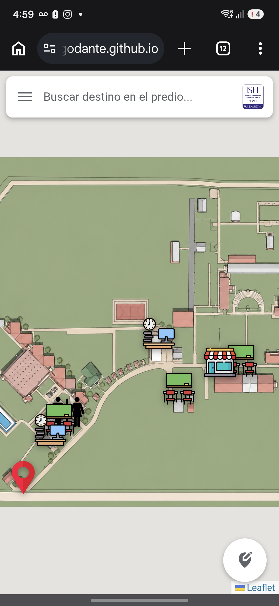
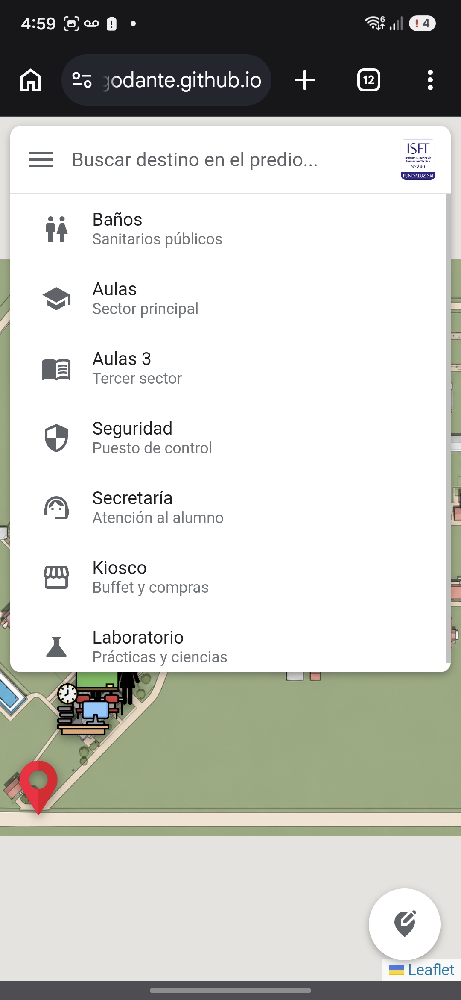
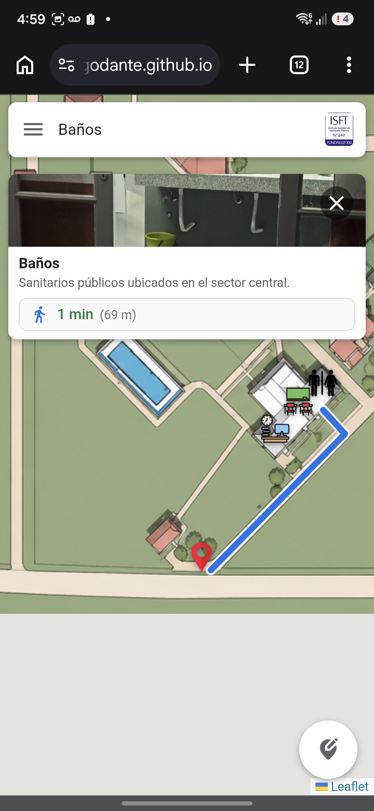

# 🗺️ Mapa Interactivo

Aplicación web desarrollada como proyecto académico con el objetivo de facilitar la orientación dentro del establecimiento educativo mediante un mapa interactivo con información de los distintos espacios y un sistema de navegación mediante códigos QR.

## 📋 Descripción

El sistema permite a estudiantes, docentes y visitantes consultar la ubicación de aulas, oficinas y otros sectores del establecimiento de manera rápida e intuitiva.

El proyecto fue desarrollado como una solución para mejorar la orientación dentro de la institución y reducir el tiempo de búsqueda de ubicaciones.

## ✨ Funcionalidades

- Visualización del mapa interactivo.
- Navegación entre diferentes sectores del establecimiento.
- Consulta de información de cada ubicación.
- Acceso mediante códigos QR.
- Interfaz simple e intuitiva.

## 🛠️ Tecnologías utilizadas

- HTML5
- CSS3
- JavaScript

## 📂 Estructura del proyecto

```
/
├── index.html
├── script.js
├── style.css
├── img/
├── capturas/
└── README.md
```

## 🚀 Cómo ejecutar el proyecto

## 🌐 Demo
https://tu-link.com

1. Clonar el repositorio.

```bash
git clone https://github.com/tuusuario/mapa-interactivo.git
```

2. Abrir el archivo `index.html` en el navegador.

No requiere instalación ni dependencias adicionales.

## 📸 Capturas

### Página principal



### Menu



### Navegación



## 👨‍💻 Autores

**Dante Sebastián Hidalgo**
**Fernando Buiani

Estudiante de Tecnicatura Superior en Análisis de Sistemas.

Actualmente buscando mi primera oportunidad profesional en el área IT.
